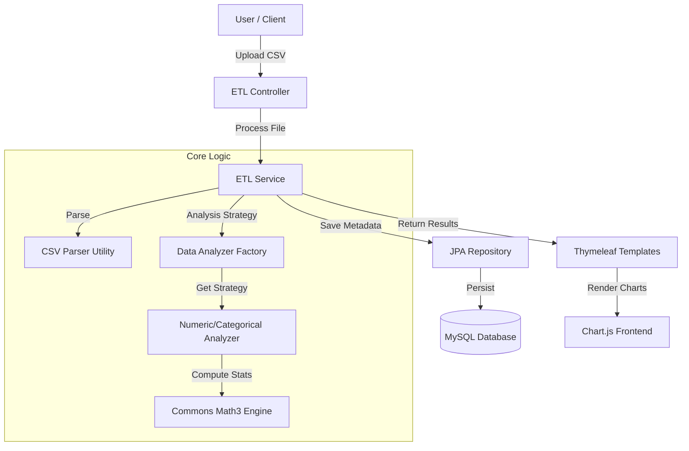

<div align="center">

  <h1>🚀 ETL Automation System</h1>
  
  <p>
    A high-throughput <b>Extract, Transform, Load (ETL)</b> pipeline built with <b>Spring Boot</b> and <b>Java 17</b>. 
    <br />
    Automates CSV data ingestion, performs statistical analysis, and visualizes insights in real-time.
  </p>

<!-- Badges -->
<p>
  <a href="https://github.com/aryasoni28/ETL_Automation/graphs/contributors">
    
  </a>
  <a href="https://github.com/aryasoni28/ETL_Automation/network/members">
    
  </a>
  <a href="https://github.com/aryasoni28/ETL_Automation/stargazers">
    
  </a>
  <a href="https://github.com/aryasoni28/ETL_Automation/issues">
    
  </a>
  <a href="https://github.com/aryasoni28/ETL_Automation/blob/master/LICENSE.txt">
    
  </a>
</p>
  
  <h4>
    <a href="#-demo">View Demo</a>
    <span> · </span>
    <a href="#-getting-started">Getting Started</a>
    <span> · </span>
    <a href="https://github.com/aryasoni28/ETL_Automation/issues">Report Bug</a>
  </h4>
</div>

<br />

<!-- Table of Contents -->
<details>
  <summary><b>📖 Table of Contents</b> (Click to Expand)</summary>
  <ol>
    <li><a href="#-about-the-project">About The Project</a></li>
    <li><a href="#-architecture">Architecture</a></li>
    <li><a href="#-tech-stack">Tech Stack</a></li>
    <li><a href="#-getting-started">Getting Started</a></li>
    <li><a href="#-usage">Usage</a></li>
    <li><a href="#-roadmap">Roadmap</a></li>
    <li><a href="#-license">License</a></li>
    <li><a href="#-contact">Contact</a></li>
  </ol>
</details>

---

## 💡 About The Project

The **ETL Automation System** is a robust enterprise-grade solution designed to eliminate manual data processing bottlenecks. By leveraging industry-standard design patterns, it ingests complex CSV datasets, normalizes the data into a relational schema, applies statistical algorithms, and presents actionable insights through an interactive dashboard.

**Key Capabilities:**
*   **📂 Automated Ingestion:** Dynamic parsing logic (using *Apache Commons CSV*) handles headers and data type inference automatically.
*   **📊 Advanced Analytics:** Built-in Strategy Pattern engine computes **Mean, Median, Skewness, Kurtosis**, and Standard Deviation on the fly.
*   **📈 Real-time Logic:** Visualizes data distributions with **Chart.js** (Histograms & Box Plots) for immediate trend analysis.
*   **💾 Optimized Storage:** 3NF MySQL schema with Batched Inserts ensures data integrity and high-performance querying.

---

## 🏗 Architecture

The system follows a strict **Layered MVC Architecture** to ensure separation of concerns and maintainability.



---

## 🛠 Tech Stack

Designed with performance and scalability in mind using the Java ecosystem.

| Component | Technology | Version |
| :--- | :--- | :--- |
| **Backend** | Java | 17 (LTS) |
| **Framework** | Spring Boot | 2.7.0 |
| **Database** | MySQL | 8.0 |
| **ORM** | Spring Data JPA | Hibernate 5 |
| **Frontend** | Thymeleaf, Bootstrap 5 | 5.1.3 |
| **Visualization** | Chart.js | 3.x |
| **Build Tool** | Maven | 3.8+ |

---

## 🚀 Getting Started

Follow these steps to set up the project locally.

### Prerequisites

*   **Java 17 Development Kit** installed.
*   **MySQL Server** running locally or in a container.
*   **Maven** installed (or use the included `mvnw` wrapper).

### Installation

1.  **Clone the Repository**
    ```bash
    git clone https://github.com/aryasoni28/ETL_Automation.git
    cd ETL_Automation
    ```

2.  **Configure Database**
    Create a schema in MySQL:
    ```sql
    CREATE DATABASE etl_database;
    ```

3.  **Update Properties**
    Open `src/main/resources/application.properties` and verify your credentials:
    ```properties
    spring.datasource.url=jdbc:mysql://localhost:3306/etl_database
    spring.datasource.username=root  # Change if needed
    spring.datasource.password=password  # Change if needed
    ```

4.  **Build the Project**
    ```bash
    mvn clean install
    ```

5.  **Run the Application**
    ```bash
    mvn spring-boot:run
    ```

The server will start at `http://localhost:8080`.

---

## 🖥 Usage

1.  **Upload Data:** Navigate to `http://localhost:8080/`. Click "Choose File" and select a valid CSV file.
2.  **Process:** Click **"Upload & Analyze"**. The system will:
    *   Parse the CSV.
    *   Detect column types (Numeric vs. Categorical).
    *   Calculate statistics.
3.  **Analyze Results:** You will be redirected to the **Results Dashboard** showing:
    *   **Data Table:** Detailed summary statistics for every column.
    *   **Histograms:** Visual distribution of numeric data.
    *   **Box Plots:** Outlier detection and quartile analysis.

---

## 🗺 Roadmap

- [ ] Add support for Excel (.xlsx) and JSON formats.
- [ ] Implement Spring Security for User Authentication.
- [ ] Containerize with Docker & Docker Compose.
- [ ] Add API generation (Swagger/OpenAPI).
- [ ] Migrate frontend to React.js for SPA architecture.

---

## 📞 Contact

**ANKAN DEBNATH** - [LinkedIn Profile](https://www.linkedin.com/in/ankan-debnath-aa6a57259/) - ankandebnath12b@gmail.com


